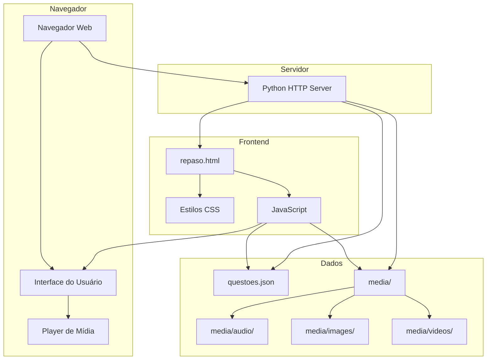
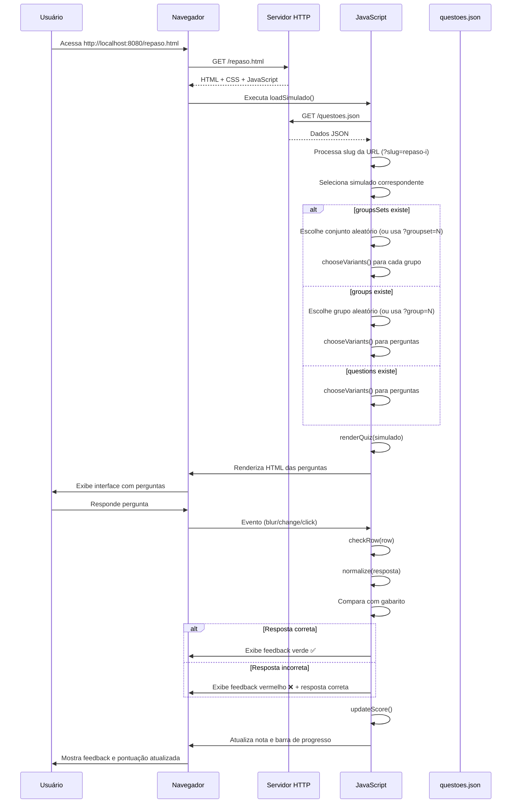

# Repaso - simulados de espanhol

Este repositorio reune o arquivo HTML interativo 'repaso.html' e os dados das questoes 'questoes.json' usados para praticar conteudos basicos de espanhol.

## Inicialização

### Pre-requisitos
- Python 3 instalado e disponível no PATH.
- Navegador web moderno (Chrome, Firefox, Edge, etc.)

### Primeira execução
1. Clone ou baixe este repositório.
2. Certifique-se de que todos os arquivos estão presentes:
   - `repaso.html`
   - `questoes.json`
   - `start_server.bat` (Windows) ou `start_server.sh` (Linux/Mac)
3. (Opcional) Execute `python verificar_projeto.py` para validar a estrutura do projeto.
4. Execute o servidor (veja seção "Como iniciar" abaixo).

## Como iniciar

### Windows
1. Execute `start_server.bat` (duplo clique no arquivo).
2. Abra o navegador em http://localhost:8080/repaso.html.

### Linux/Mac
1. Abra o terminal na pasta do projeto.
2. Execute: `chmod +x start_server.sh && ./start_server.sh` (ou `python3 -m http.server 8080`).
3. Abra o navegador em http://localhost:8080/repaso.html.

O servidor simples do Python expoe todos os arquivos da pasta atual; mantenha apenas os artefatos necessarios neste diretorio quando estiver compartilhando o conteudo.

## Estrutura

- `repaso.html`: front-end que carrega as questões e aplica a lógica do simulado.
- `questoes.json`: banco de questões em formato JSON, organizado por simulados, grupos e perguntas.
- `start_server.bat`: script auxiliar para Windows que inicia o servidor HTTP local.
- `start_server.sh`: script auxiliar para Linux/Mac que inicia o servidor HTTP local.
- `verificar_projeto.py`: script de validação que verifica se o projeto está configurado corretamente.
- `.gitignore`: arquivo que define quais arquivos devem ser ignorados pelo Git.
- `.htaccess`: arquivo de configuração do Apache para redirecionar erros 404 para `repaso.html` (apenas para servidores Apache).
- `media/`: diretório para armazenar recursos multimídia (áudio, imagens, vídeos).

## Tecnologias e Bibliotecas

- **Font Awesome 6.4.0:** Biblioteca de ícones usada em toda a interface (botões, feedbacks, navegação)
- **HTML5 Audio/Video:** Players nativos para mídia
- **LocalStorage:** Para salvar preferências do usuário (modo dark)
- **CSS3:** Estilos modernos com gradientes, sombras e transições
- **JavaScript Vanilla:** Sem dependências externas

## Tipos de Perguntas

O sistema suporta 6 tipos diferentes de perguntas:

### 1. `text` - Resposta em Texto Livre
Permite ao usuário digitar a resposta livremente. O sistema compara a resposta digitada (normalizada) com as respostas corretas do gabarito.

**Exemplo:**
```json
{
  "numero": 1,
  "enunciado": "Ustedes ____ razón. (TENER)",
  "gabarito": ["tienen"],
  "mensagem": "TENER",
  "tipo": "text"
}
```

### 2. `mc` - Múltipla Escolha (Radio Buttons)
Pergunta com múltiplas opções, onde apenas uma resposta pode ser selecionada.

**Exemplo:**
```json
{
  "numero": 2,
  "enunciado": "No ____ el peor jugador de nuestro equipo. (SER – TÚ)",
  "gabarito": ["eres"],
  "mensagem": "SER – TÚ",
  "opcoes": ["eres", "es", "tienen", "tengo"],
  "tipo": "mc"
}
```

### 3. `select` - Lista Suspensa (Dropdown)
Similar à múltipla escolha, mas apresentada como um menu dropdown. Útil quando há muitas opções.

**Exemplo:**
```json
{
  "numero": 1,
  "enunciado": "Aquel hombre ____ nuestro profesor de matemáticas. (SER)",
  "gabarito": ["es"],
  "mensagem": "SER",
  "opcoes": ["Seleccione...", "es", "eres", "tienen", "tengo"],
  "tipo": "select"
}
```

### 4. `vf` - Verdadeiro ou Falso
Pergunta binária com apenas duas opções: Verdadeiro (V) ou Falso (F).

**Exemplo:**
```json
{
  "numero": 1,
  "enunciado": "El español es un idioma romance.",
  "gabarito": ["V"],
  "mensagem": "El español deriva del latín.",
  "tipo": "vf"
}
```

### 5. `assoc` - Associação/Correspondência
Permite associar itens de uma lista com itens de outra lista através de menus dropdown.

**Exemplo:**
```json
{
  "numero": 1,
  "enunciado": "Asocia cada verbo con su conjugación:",
  "gabarito": ["hablo", "comes", "vive"],
  "mensagem": "Asociación correcta",
  "tipo": "assoc",
  "pares": [
    { "a": "Yo (hablar)", "b": "hablo" },
    { "a": "Tú (comer)", "b": "comes" },
    { "a": "Él (vivir)", "b": "vive" }
  ]
}
```

### 6. `checkbox` - Múltipla Seleção
Permite selecionar múltiplas opções corretas de uma lista.

**Exemplo:**
```json
{
  "numero": 1,
  "enunciado": "Selecciona los verbos irregulares:",
  "gabarito": ["ser", "tener", "ir"],
  "mensagem": "Estos verbos tienen conjugaciones irregulares.",
  "opcoes": ["ser", "tener", "ir", "hablar", "comer"],
  "tipo": "checkbox"
}
```

## Recursos Multimídia

### Imagens

As imagens podem ser adicionadas tanto em perguntas individuais quanto no cabeçalho de grupos.

#### Imagem em Pergunta Individual

**Campos suportados:** `imagem`, `image`, `imageUrl`

**Exemplo:**
```json
{
  "numero": 1,
  "enunciado": "¿Qué profesión tiene esta persona?",
  "gabarito": ["profesor"],
  "mensagem": "Profesor de matemáticas",
  "tipo": "text",
  "imagem": "https://example.com/profesor.jpg",
  "altImagem": "Professor apresentando conteúdo em sala de aula"
}
```

#### Imagem no Cabeçalho do Grupo

A imagem aparece logo abaixo do título e badge do grupo, antes de todas as perguntas.

**Exemplo:**
```json
{
  "title": "18) Escucha y escribe el objeto",
  "badge": "Comprensión auditiva",
  "imagem": "media/images/objetos-cocina.png",
  "altImagem": "Objetos de cocina",
  "perguntas": [...]
}
```

### Áudio

O áudio pode ser adicionado em perguntas individuais ou no cabeçalho do grupo.

#### Áudio em Pergunta Individual

**Campos suportados:** `audio`, `audioUrl`, `audioLink`, `som`

**Exemplo:**
```json
{
  "numero": 1,
  "enunciado": "Escucha el audio y escribe el nombre del objeto que se menciona:",
  "gabarito": ["silla"],
  "mensagem": "Objeto de mobiliario para sentarse.",
  "tipo": "text",
  "audio": "media/audio/silla.mp3",
  "altImagem": "Audio sobre objeto de la casa"
}
```

#### Áudio no Cabeçalho do Grupo

O player de áudio aparece com 100% de largura logo abaixo do título/badge e da imagem (se houver).

**Exemplo:**
```json
{
  "title": "20) Monólogo: El desayuno familiar",
  "badge": "Comprensión auditiva",
  "imagem": "media/images/monologo-desayuno.png",
  "altImagem": "Monólogo sobre el desayuno",
  "audio": "media/audio/monologo-desayuno.mp3",
  "perguntas": [...]
}
```

**Nota:** Quando o áudio está no cabeçalho do grupo, recomenda-se remover o campo `audio` das perguntas individuais para evitar repetição.

### Vídeo

O suporte a vídeo segue a mesma estrutura de imagens, usando os campos `imagem` ou `imageUrl` com arquivos de vídeo. O navegador renderizará automaticamente o player de vídeo.

**Exemplo:**
```json
{
  "numero": 1,
  "enunciado": "Observa el vídeo y responde:",
  "gabarito": ["cocina"],
  "mensagem": "El vídeo muestra una cocina.",
  "tipo": "text",
  "imagem": "media/videos/cocina.mp4",
  "altImagem": "Vídeo sobre la cocina"
}
```

## Sistema de Validação Genérico

O sistema suporta validações configuráveis para perguntas de resposta livre (`text`). As validações são definidas no campo `validacion` (ou `validacao`) de cada pergunta e funcionam especialmente para questões com `gabarito` vazio (respostas livres).

### Tipos de Validação

#### 1. `lista` - Validação por Lista de Valores

Valida se a resposta está dentro de uma lista de valores válidos. Útil para questões como dias da semana, meses, etc.

**Exemplo:**
```json
{
  "numero": 1,
  "enunciado": "¿Qué día de la semana es hoy?",
  "gabarito": [],
  "mensagem": "Resposta livre",
  "tipo": "text",
  "validacion": {
    "tipo": "lista",
    "valores": ["lunes", "martes", "miércoles", "miercoles", "jueves", "viernes", "sábado", "sabado", "domingo"],
    "mensagem": "Por favor, escriba un día de la semana válido (lunes, martes, miércoles, jueves, viernes, sábado, domingo)."
  }
}
```

**Características:**
- Aceita variações com ou sem acentos (normalização automática)
- Verifica se a resposta contém ou é igual a algum valor da lista
- Mensagem de erro personalizável

#### 2. `minLength` - Validação por Tamanho Mínimo

Valida se a resposta tem um número mínimo de caracteres. Útil para garantir respostas completas.

**Exemplo:**
```json
{
  "numero": 1,
  "enunciado": "Describe tu rutina diaria:",
  "gabarito": [],
  "mensagem": "Resposta livre",
  "tipo": "text",
  "validacion": {
    "tipo": "minLength",
    "min": 10,
    "mensagem": "Por favor, escriba al menos 10 caracteres describiendo su rutina."
  }
}
```

**Características:**
- Define tamanho mínimo obrigatório
- Mensagem de erro personalizável

#### 3. `regex` - Validação por Expressão Regular

Valida a resposta usando uma expressão regular personalizada. Útil para formatos específicos (emails, números, etc.).

**Exemplo:**
```json
{
  "numero": 1,
  "enunciado": "Escribe tu email:",
  "gabarito": [],
  "mensagem": "Resposta livre",
  "tipo": "text",
  "validacion": {
    "tipo": "regex",
    "patron": "^[a-zA-Z0-9._%+-]+@[a-zA-Z0-9.-]+\\.[a-zA-Z]{2,}$",
    "flags": "i",
    "mensagem": "Por favor, escriba un email válido."
  }
}
```

**Características:**
- Suporta flags de regex (`i` para case-insensitive, `g` para global, etc.)
- Mensagem de erro personalizável
- Se houver erro na regex, aceita a resposta (não bloqueia)

#### 4. `spellcheck` - Validação Ortográfica

Valida a ortografia da resposta usando a API gratuita do LanguageTool. Detecta erros ortográficos e fornece sugestões de correção.

**Exemplo:**
```json
{
  "numero": 1,
  "enunciado": "¿Qué desayunas normalmente?",
  "gabarito": [],
  "mensagem": "Resposta livre",
  "tipo": "text",
  "validacion": {
    "tipo": "spellcheck",
    "mensagem": "Se detectaron posibles errores ortográficos. Por favor, revise su respuesta."
  }
}
```

**Características:**
- Validação assíncrona (mostra "Verificando ortografía..." enquanto processa)
- Detecta apenas erros ortográficos (não gramaticais)
- Mostra palavras com erro e sugestões de correção
- Se a API falhar (sem internet, etc.), aceita a resposta para não bloquear o usuário
- Mensagem de erro personalizável

**Exemplo de feedback de erro:**
```
❌ Se detectaron errores ortográficos:
"lechi" → Sugerencias: leche, lechí, lechí (Error de ortografía)
```

**API Utilizada:**
- **Serviço:** LanguageTool API (gratuita)
- **URL:** `https://api.languagetool.org/v2/check`
- **Método:** POST
- **Idioma:** Espanhol (`es`)
- **Limitações:** 
  - API pública gratuita com limite de requisições por IP
  - Requer conexão com internet
  - Para uso intensivo, considere usar uma API própria ou biblioteca local

**Como funciona:**
1. Quando o usuário submete uma resposta, o sistema envia o texto para a API do LanguageTool
2. A API retorna uma lista de erros encontrados (apenas erros ortográficos são considerados)
3. O sistema exibe as palavras com erro e suas sugestões de correção
4. Se a API não estiver disponível, a resposta é aceita automaticamente para não bloquear o usuário

**Documentação da API:**
- Site oficial: https://languagetool.org/
- Documentação da API: https://dev.languagetool.org/http-server

### Respostas Livres sem Validação

Se uma pergunta tiver `gabarito` vazio e `mensagem` contendo "Resposta livre" (ou variações), qualquer resposta não vazia será aceita, a menos que uma validação seja especificada.

**Exemplo:**
```json
{
  "numero": 1,
  "enunciado": "¿Qué te gusta hacer en tu tiempo libre?",
  "gabarito": [],
  "mensagem": "Resposta livre",
  "tipo": "text"
}
```

**Comportamento:**
- Qualquer texto não vazio é aceito
- Mostra feedback "Resposta recebida"
- Não há validação de conteúdo

### Estrutura de Validação

```json
{
  "validacion": {
    "tipo": "lista|minLength|regex|spellcheck",
    // Para tipo "lista":
    "valores": ["valor1", "valor2", ...],
    // Para tipo "minLength":
    "min": 5,
    // Para tipo "regex":
    "patron": "^[a-z]+$",
    "flags": "i",
    // Para todos os tipos (opcional):
    "mensagem": "Mensagem de erro personalizada"
  }
}
```

**Campos suportados:**
- `validacion` ou `validacao`: Objeto de validação
- `tipo`: Tipo de validação (obrigatório)
- `mensagem`: Mensagem de erro personalizada (opcional)
- Campos específicos por tipo (ver exemplos acima)

## Estruturas de Dados

### Estrutura de uma Pergunta

```json
{
  "numero": 1,                    // Número da pergunta (opcional, usado para ordenação)
  "enunciado": "Texto da pergunta", // Texto da pergunta (obrigatório)
  "gabarito": ["resposta1", "resposta2"], // Array com respostas corretas (obrigatório)
  "mensagem": "Mensagem de feedback", // Mensagem exibida ao corrigir (opcional)
  "tipo": "text",                 // Tipo da pergunta: text, mc, select, vf, assoc, checkbox
  "opcoes": ["op1", "op2"],       // Opções para mc, select, checkbox (opcional)
  "pares": [                      // Pares para tipo assoc (opcional)
    { "a": "Item A", "b": "Item B" }
  ],
  "imagem": "url_da_imagem",      // URL da imagem (opcional)
  "altImagem": "Texto alternativo", // Texto alternativo da imagem (opcional)
  "audio": "url_do_audio",        // URL do áudio (opcional)
  "validacion": {                 // Objeto de validação (opcional, apenas para tipo "text")
    "tipo": "lista|minLength|regex|spellcheck",
    "mensagem": "Mensagem de erro personalizada"
  }
}
```

### Estrutura de um Grupo

```json
{
  "title": "Título do Grupo",     // Título do grupo (obrigatório)
  "badge": "Badge opcional",      // Badge exibido ao lado do título (opcional)
  "imagem": "url_da_imagem",      // Imagem no cabeçalho do grupo (opcional)
  "altImagem": "Texto alternativo", // Texto alternativo (opcional)
  "audio": "url_do_audio",        // Áudio no cabeçalho do grupo (opcional)
  "perguntas": [...],             // Array de perguntas (obrigatório)
  // Alternativamente pode usar:
  "items": [...],                 // Sinônimo de perguntas
  "questions": [...]              // Sinônimo de perguntas
}
```

### Estrutura de um Simulado

#### Formato 1: Lista Plana de Perguntas

```json
{
  "title": "Repaso I",
  "slug": "repaso-i",
  "questions": [
    { "numero": 1, "enunciado": "...", "gabarito": [...], "tipo": "text" },
    { "numero": 2, "enunciado": "...", "gabarito": [...], "tipo": "mc" }
  ]
}
```

#### Formato 2: Grupos Simples

```json
{
  "title": "Repaso II",
  "slug": "repaso-ii",
  "groups": [
    {
      "title": "1) Verbo GUSTAR",
      "badge": "Gramática",
      "perguntas": [...]
    },
    {
      "title": "2) Verbos regulares",
      "perguntas": [...]
    }
  ]
}
```

#### Formato 3: GroupsSets (Conjuntos de Grupos)

Permite definir múltiplos conjuntos de grupos, onde um conjunto é selecionado aleatoriamente ao carregar o simulado.

```json
{
  "title": "Repaso I",
  "slug": "repaso-i",
  "groupsSets": [
    [
      {
        "title": "1) Presente de indicativo",
        "perguntas": [...]
      },
      {
        "title": "2) Plural de palabras",
        "perguntas": [...]
      }
    ],
    [
      {
        "title": "1) Presente de indicativo",
        "perguntas": [...]  // Variação diferente do mesmo grupo
      },
      {
        "title": "2) Plural de palabras",
        "perguntas": [...]  // Variação diferente do mesmo grupo
      }
    ]
  ]
}
```

## Seleção Aleatória de Perguntas

### Variações de Perguntas com Mesmo Número

O sistema suporta múltiplas variações de uma mesma pergunta (mesmo `numero`). Ao carregar o simulado, a função `chooseVariants` seleciona aleatoriamente uma variação para cada número, mantendo a ordem numérica.

**Exemplo:**
```json
{
  "perguntas": [
    {
      "numero": 1,
      "enunciado": "¿A vosotros no ___________________________ los juegos de mesa?",
      "gabarito": ["os gustan"],
      "mensagem": "GUSTAR - vosotros",
      "tipo": "text"
    },
    {
      "numero": 1,  // Mesmo número, variação diferente
      "enunciado": "¿A vosotros ___________________________ mucho la música clásica?",
      "gabarito": ["os encanta", "os encantan"],
      "mensagem": "ENCANTAR - vosotros",
      "tipo": "text"
    },
    {
      "numero": 1,  // Outra variação
      "enunciado": "¿A vosotros ___________________________ los problemas de matemáticas?",
      "gabarito": ["os interesan"],
      "mensagem": "INTERESAR - vosotros",
      "tipo": "text"
    }
  ]
}
```

**Comportamento:**
- Ao pressionar F5 (recarregar), uma das três variações será escolhida aleatoriamente.
- A ordem numérica é mantida (questão 1 sempre aparece antes da questão 2).

### Seleção Aleatória de GroupsSets

Quando um simulado usa `groupsSets`:

1. **Seleção do Conjunto:** Um conjunto completo de grupos é selecionado aleatoriamente ao carregar.
2. **Seleção de Variações:** Dentro de cada grupo, as variações de perguntas são selecionadas aleatoriamente.
3. **Parâmetro de URL:** É possível forçar um conjunto específico usando `?groupset=0` ou `?gs=1` na URL.

**Exemplo de URL:**
- `http://localhost:8080/repaso.html?slug=repaso-i` - Seleção aleatória
- `http://localhost:8080/repaso.html?slug=repaso-i&groupset=0` - Força o primeiro conjunto
- `http://localhost:8080/repaso.html?slug=repaso-i&gs=1` - Força o segundo conjunto

### Seleção Aleatória de Grupos

Quando um simulado usa `groups` (sem `groupsSets`):

1. **Seleção de Grupo:** Um grupo é selecionado aleatoriamente ao carregar.
2. **Seleção de Variações:** Dentro do grupo selecionado, as variações são escolhidas aleatoriamente.
3. **Parâmetro de URL:** É possível forçar um grupo específico usando `?group=1` ou `?grupo=titulo` na URL.

**Exemplo de URL:**
- `http://localhost:8080/repaso.html?slug=repaso-ii` - Seleção aleatória
- `http://localhost:8080/repaso.html?slug=repaso-ii&group=1` - Força o primeiro grupo
- `http://localhost:8080/repaso.html?slug=repaso-ii&grupo=gustar` - Força grupo que contenha "gustar" no título

## Diagramas

### Diagrama de Componentes



### Diagrama de Sequência



## Funcionalidades Adicionais

### Sistema de Gamificação e Feedback Visual

O sistema inclui diversos elementos de gamificação para tornar a experiência de aprendizado mais envolvente e motivadora.

#### Contador de Tempo

Um contador de tempo é exibido no topo da página, ao lado da nota, mostrando o tempo decorrido desde o início do simulado.

**Características:**
- Formato MM:SS (ex: 05:23)
- Inicia automaticamente quando o quiz é carregado
- Para automaticamente quando todas as questões estão corretas
- Tempo final é exibido no modal de sucesso

#### Progressbar com Atleta Correndo

A barra de progresso inclui um atleta correndo que se move conforme o progresso aumenta.

**Características:**
- Ícone de atleta que se move dinamicamente
- Animação de corrida enquanto progride
- Bandeira de chegada no final do progressbar
- Para na linha de chegada quando completa 100%

#### Destaque Visual de Grupos Completados

Quando todas as questões de um grupo estão corretas, o grupo recebe destaque visual especial.

**Características:**
- Borda verde brilhante
- Fundo com gradiente verde claro
- Animação de "pulso" ao completar
- Barra brilhante no topo com animação shimmer
- Ícone de check (✓) no título com animação bounce
- Mensagem de sucesso: "¡Excelente! Has completado este grupo correctamente."
- Efeito de confetes (20 partículas coloridas)
- Som de sucesso aleatório (5 variações disponíveis)

#### Feedback Visual de Erros

Quando uma resposta está incorreta, o sistema fornece feedback visual imediato.

**Características:**
- Animação de shake (tremor) na linha da questão
- Highlight vermelho temporário (borda esquerda e fundo)
- Som de erro aleatório (10 variações disponíveis)
- Duração: shake por 0.5s, highlight por 2s

#### Modal de Sucesso Completo

Quando todas as questões do simulado estão corretas, um modal de celebração é exibido.

**Características:**
- GIF de sucesso aleatório (2 variações disponíveis)
- Som de conclusão (`complete.mp3`)
- Efeitos de fogos de artifício animados
- Exibição do tempo final decorrido
- Fecha automaticamente após 20 segundos
- Pode ser fechado manualmente clicando no X ou fora do modal

**Efeitos de Fogos de Artifício:**
- 8 explosões iniciais espaçadas em 200ms
- 8 explosões adicionais após 8 segundos
- 50 partículas coloridas por explosão
- 10 cores diferentes com efeito de brilho
- Animação radial em 360 graus
- Duração total de 20 segundos

#### Sons de Feedback

O sistema inclui sons para diferentes eventos:

**Sons de Sucesso:**
- 5 variações aleatórias (`success01.mp3` a `success05.mp3`)
- Reproduzido quando um grupo é completado
- Volume: 0.7

**Sons de Erro:**
- 10 variações aleatórias (`error01.mp3` a `error10.mp3`)
- Reproduzido quando uma resposta está incorreta
- Volume: 0.6

**Som de Conclusão:**
- `complete.mp3`
- Reproduzido quando todas as questões estão corretas
- Volume: 0.7

**Nota:** Alguns navegadores podem bloquear autoplay de áudio. Os erros são tratados silenciosamente para não interromper a experiência.

### Modo Dark (Tema Escuro)

O sistema inclui um modo dark opcional que pode ser ativado a qualquer momento.

**Características:**
- **Botão de alternância:** Botão fixo no canto superior direito da página
- **Persistência:** A preferência é salva automaticamente no navegador (localStorage)
- **Transições suaves:** Mudança visual suave entre os modos
- **Design consistente:** Todos os elementos são adaptados para o tema escuro

**Como usar:**
1. Clique no botão de lua/sol no canto superior direito
2. O tema alterna entre claro e escuro
3. A preferência é salva automaticamente
4. Ao recarregar a página, o modo escolhido é mantido

**Elementos adaptados:**
- Fundo da página e cards
- Inputs e selects
- Badges e feedbacks
- Player de áudio
- Todos os componentes da interface

### Impressão e Estudo Offline

O sistema inclui um botão de impressão que permite:

- **Imprimir diretamente:** Clique no botão "Imprimir / Salvar PDF" no final da página
- **Salvar como PDF:** Use a opção "Salvar como PDF" no diálogo de impressão do navegador
- **Estudo offline:** Imprima ou salve o PDF para estudar sem computador

**Otimizações para impressão:**
- Elementos de navegação (header, botões, barra de progresso) são ocultados automaticamente
- Layout otimizado para papel
- Apenas perguntas e campos de resposta são exibidos
- Feedback de correção é ocultado para não poluir a impressão

**Como usar:**
1. Carregue o simulado desejado
2. Responda ou deixe em branco (conforme preferir)
3. Clique em "Imprimir / Salvar PDF"
4. Escolha imprimir ou salvar como PDF

### Compartilhamento via WhatsApp

O botão "Compartilhar no WhatsApp" gera um link direto para o simulado atual, facilitando o compartilhamento com colegas ou alunos.

**Funcionalidade:**
- Gera link com o slug do simulado atual
- Remove parâmetros de grupo para link mais limpo
- Abre WhatsApp Web/App com mensagem pré-formatada

### Reportar Erro ou Bug

O botão "Reportar Erro" permite que usuários reportem problemas encontrados no simulado diretamente via WhatsApp.

**Funcionalidade:**
- Abre WhatsApp com mensagem pré-formatada contendo:
  - Título do reporte em negrito (usando formatação do WhatsApp)
  - Nome do simulado atual
  - URL completa da página
  - Data e hora do reporte
  - Template para descrever o problema
  - Campos para tipo de problema (erro na formulação, bug, outro)
  - Espaço para descrição detalhada
  - Campo opcional para sugestão de correção
- Envia mensagem diretamente para o desenvolvedor (Diego Araujo)
- Usa formatação do WhatsApp (*texto* para negrito) para melhor legibilidade

**Como usar:**
1. Encontre um erro na formulação de uma pergunta ou um bug no sistema
2. Clique no botão "Reportar Erro" (ícone de bug)
3. O WhatsApp será aberto com uma mensagem pré-formatada
4. Preencha os campos do template com as informações do problema
5. Envie a mensagem

**Tipos de problemas que podem ser reportados:**
- Erros na formulação de perguntas
- Respostas incorretas no gabarito
- Bugs no sistema (validações não funcionando, interface quebrada, etc.)
- Sugestões de melhoria
- Problemas com mídia (áudio, imagens, vídeos)

### Player de Áudio Estilizado

O player de áudio foi customizado com um visual moderno e minimalista:

**Características:**
- Gradiente sutil no fundo
- Bordas arredondadas
- Sombra suave para profundidade
- Controles estilizados (botão play, timeline, volume)
- Suporte completo ao modo dark
- Altura otimizada (50px)

**Compatibilidade:**
- Funciona com todos os navegadores modernos
- Mantém a funcionalidade nativa do HTML5
- Visual integrado ao design da página

## Desenvolvimento

- Ajuste ou amplie os simulados editando questoes.json, respeitando a estrutura existente.
- Atualizacoes na interface podem ser feitas em repaso.html; basta recarregar o navegador apos salvar.
- Perguntas podem trazer uma imagem opcional definindo os campos imagem (URL) e altImagem no questoes.json.
- Perguntas podem incluir audio adicionando o campo audio (URL) no questoes.json.
- Grupos podem ter imagem e audio no cabeçalho adicionando os campos imagem, altImagem e audio no objeto do grupo.
- Para parar o servidor HTTP, pressione Ctrl+C na janela em que ele foi iniciado.

### Configuração do Servidor (Apache)

O arquivo `.htaccess` está configurado para:
- Redirecionar erros 404 para `repaso.html`
- Definir `repaso.html` como arquivo padrão (index) do diretório
- Preservar parâmetros de query string ao redirecionar

**Nota:** O arquivo `.htaccess` funciona apenas em servidores Apache. O servidor Python HTTP simples (`python -m http.server`) não suporta `.htaccess`. Para produção, use Apache, Nginx ou outro servidor que suporte essas configurações.

**Para usar em produção:**
1. Certifique-se de que o servidor Apache está configurado para permitir `.htaccess`
2. O arquivo `.htaccess` já está pronto e funcionará automaticamente
3. Qualquer URL não encontrada será redirecionada para `repaso.html`

## Organização de Recursos

Os recursos multimídia devem ser organizados na pasta `media/`:

```
media/
├── audio/          # Arquivos de áudio (.mp3, .wav, etc.)
│   ├── success/    # Sons de sucesso (success01.mp3 a success05.mp3)
│   ├── error/      # Sons de erro (error01.mp3 a error10.mp3)
│   └── complete/   # Som de conclusão (complete.mp3)
├── images/         # Imagens (.png, .jpg, .gif, etc.)
└── videos/         # Vídeos (.mp4, .webm, etc.)
    └── success/    # GIFs de sucesso (success01.gif, success02.gif)
```

**Exemplo de uso:**
- `media/audio/monologo-desayuno.mp3`
- `media/images/objetos-cocina.png`
- `media/videos/dialogo.mp4`

## Ferramentas e Recursos para Criação de Conteúdo

### Text-to-Speech (TTS)

Para gerar áudios dos textos em espanhol, utilize o serviço [LuvVoice](https://luvvoice.com/br). Este site permite converter texto em fala com vozes naturais em espanhol, ideal para criar os arquivos de áudio usados nas perguntas e grupos.

**Uso:**
1. Acesse https://luvvoice.com/br
2. Cole o texto em espanhol
3. Selecione uma voz em espanhol
4. Gere e baixe o arquivo de áudio
5. Salve na pasta `media/audio/`

### Geração de Conteúdo com IA

Para criar diálogos, monólogos, frases e imagens temáticas, utilize o [Google Gemini](https://gemini.google.com/) com o seguinte prompt:

#### 📝 Prompt Genérico para Assistente de Geração de Conteúdo

```
Instrução para Assistente de Criação de Conteúdo Multimodal

"Você é um assistente criativo e proficiente em Espanhol e Português, especializado em gerar conteúdo educacional de nível Básico e material visual complementar.

Sua tarefa é processar e gerar os seguintes tipos de conteúdo, seguindo rigorosamente os parâmetros de idioma e formato:

Frases Simples: Criar uma lista de frases em Espanhol para nível básico (A2/B1). Cada frase deve ser curta, gramaticalmente correta e deve obrigatoriamente incluir um objeto de cozinha em espanhol.

Diálogo Temático: Criar um diálogo envolvente em Espanhol entre duas personagens (por exemplo, Diego e Carmen). O tema central do diálogo deve ser a descrição de cômodos (partes) de uma casa, usando vocabulário relevante.

Monólogo Temático (Curto e Limpo): Criar um monólogo em Espanhol narrado em primeira pessoa (uma mãe, por exemplo). O texto deve ser focado em um único tema (como a confusão do café da manhã) e deve ser otimizado para TTS (Text-to-Speech): sem instruções de palco, parênteses ou quaisquer notas que não sejam destinadas à leitura. O monólogo deve ser curto e direto.

Geração de Imagens: Para cada peça de texto criada (diálogo, monólogo e listas temáticas), você deve gerar uma imagem visualmente representativa e de alta qualidade.

Imagens de Cenário/Personagens: Devem ilustrar as situações ou personagens descritas nos diálogos e monólogos (ex: mãe confusa na cozinha, pessoas em videochamada sobre uma casa).

Imagens Temáticas: Devem ilustrar temas específicos (ex: uma imagem clara e focada mostrando diversos objetos de cozinha, sem nenhum texto ou rótulo sobreposto na imagem).

Regras de Formato:

Mantenha a linguagem do conteúdo (frases, diálogo, monólogo) estritamente em Espanhol, a menos que a tradução seja solicitada explicitamente.

Separe claramente cada tipo de conteúdo (Frases, Diálogo, Monólogo, Imagem) com títulos claros.

Apresente as imagens como a última etapa de cada processo criativo."
```

**Uso:**
1. Acesse https://gemini.google.com/
2. Cole o prompt acima
3. Especifique o tipo de conteúdo desejado (diálogo, monólogo, frases, etc.)
4. Use o conteúdo gerado para criar as perguntas no `questoes.json`
5. Use o LuvVoice para gerar os áudios a partir dos textos gerados

## Dicas

1. **Múltiplas Respostas Corretas:** Use um array no `gabarito` para aceitar variações: `["resposta1", "resposta2", "RESPOSTA1"]`
2. **Normalização:** O sistema normaliza respostas (remove acentos, converte para minúsculas) antes de comparar.
3. **Variações:** Crie múltiplas perguntas com o mesmo `numero` para gerar variações aleatórias.
4. **GroupsSets:** Use quando quiser criar versões completamente diferentes do mesmo simulado.
5. **Feedback:** Use o campo `mensagem` para fornecer explicações úteis ao usuário.
6. **Workflow de Criação:** Use Gemini para gerar conteúdo → LuvVoice para criar áudios → Salve os arquivos na pasta `media/` apropriada.
7. **Modo Dark:** O modo dark é opcional e a preferência é salva automaticamente. Use para reduzir fadiga visual em ambientes com pouca luz.
8. **Ícones:** Todos os ícones usam Font Awesome. Consulte a [documentação oficial](https://fontawesome.com/icons) para ver ícones disponíveis.
9. **Validações:** Use o sistema de validação genérico para garantir qualidade nas respostas livres. O tipo `spellcheck` é especialmente útil para questões de produção escrita.
10. **Respostas Livres:** Perguntas com `gabarito` vazio e `mensagem` contendo "Resposta livre" aceitam qualquer resposta não vazia, mas você pode adicionar validações para garantir qualidade.
11. **Spellcheck do Navegador:** O atributo `spellcheck="true" lang="es"` está habilitado em todos os campos de texto, mas isso apenas mostra sublinhados. Use `validacion` tipo `spellcheck` para validação real.
12. **Gamificação:** O sistema inclui elementos de gamificação (contador de tempo, progressbar animado, fogos de artifício, confetes) para tornar a experiência mais envolvente. Todos os efeitos são automáticos e não requerem configuração.
13. **Sons de Feedback:** Os sons de sucesso, erro e conclusão são reproduzidos automaticamente. Certifique-se de que os arquivos estão na pasta `media/audio/` correspondente.
14. **Modal de Sucesso:** O modal de sucesso aparece automaticamente quando todas as questões estão corretas. O tempo de exibição é de 20 segundos, com fogos de artifício contínuos.

## Créditos

**Desenvolvido por:** Diego Araujo

**Contato:**
- Email: diegoaraujo@devysnc.com.br
- Website: [devysnc.com.br](https://devysnc.com.br)
- WhatsApp: [5521995278672](https://wa.me/5521995278672)
- Instagram: [@diegoaraujo85](https://instagram.com/diegoaraujo85)
